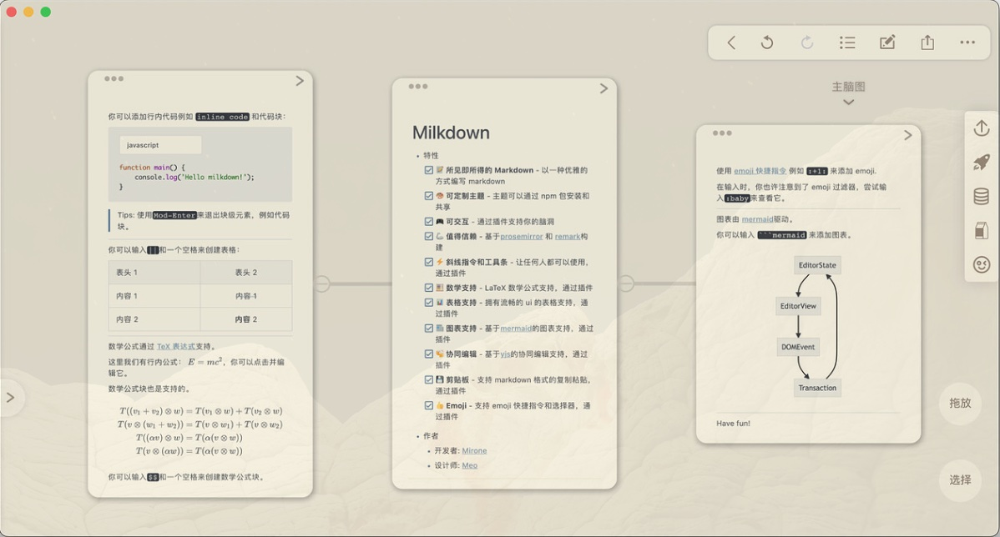

<h1 align="center" style="margin-top: 10px;">Milkdown</h1>

  <b>Use <a href="https://github.com/Saul-Mirone/milkdown">milkdown</a> as markdown editor of MarginNote</b>

  
  
  
  

## Document
[简体中文](https://bbs.marginnote.cn/t/topic/34772)
## Development
🚧
## Acknowledgements

- [Milkdown](https://github.com/Saul-Mirone/milkdown)：Plugin driven WYSIWYG markdown editor framework.
- [OhMyMN](https://github.com/marginnoteapp/ohmymn)：MarginNote addon control panel and development framework.

## License

[MIT](https://github.com/marginnoteapp/milkdown/blob/main/LICENSE)
